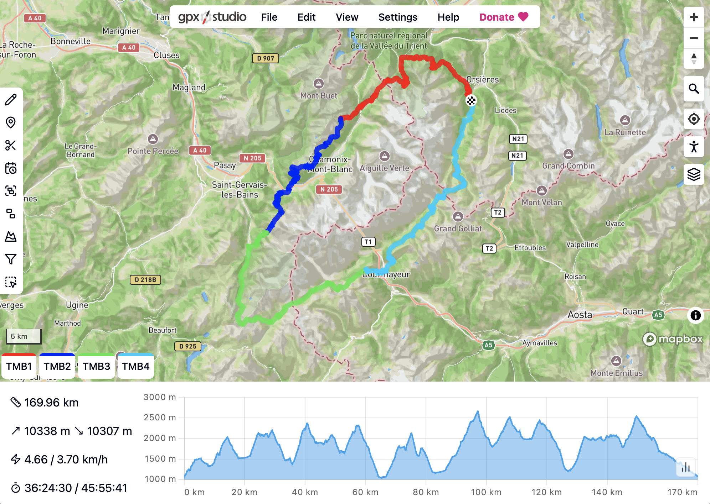

<picture>
  <source media="(prefers-color-scheme: dark)" srcset="website/static/logo-dark.svg">
  
</picture>

**gpx.studio** is an online tool for creating and editing GPX files.



This repository contains the source code of the new website, currently available [here](https://gpx.studio/gpx.studio).

## Contributing

Please create an issue if you find a bug or have a feature request.

Code contributions are also welcome, but except for obvious bug fixes, please open an issue first to discuss the changes you would like to make.

## Translation

The website is translated by volunteers on a collaborative translation platform.
You can help complete and improve the translations by joining the [Crowdin project](https://crowdin.com/project/gpxstudio).
If you would like to start the translation in a new language, please contact me or create an issue.

Any help is greatly appreciated!

## Development

The code is split into two parts:
- `gpx`: a Typescript library for parsing and manipulating GPX files,
- `website`: the website itself, which is a [SvelteKit](https://kit.svelte.dev/) application.

You will need [Node.js](https://nodejs.org/) to build and run these two parts.

### Building the `gpx` library

```bash
cd gpx
npm install
npm run build
```

### Running the website

To be able to load the map, you will need to create your own <a href="https://account.mapbox.com/auth/signup" target="_blank">Mapbox access token</a> and store it in a `.env` file in the `website` directory.

```bash
cd website
echo PUBLIC_MAPBOX_TOKEN={YOUR_MAPBOX_TOKEN} >> .env
npm install
npm run dev
```

## Credits

This project has been made possible thanks to the following open source projects:

- Development:
  - [Svelte](https://github.com/sveltejs/svelte) and [SvelteKit](https://github.com/sveltejs/kit) — seamless development experience
  - [MDsveX](https://github.com/pngwn/MDsveX) — allowing a Markdown-based documentation
  - [svelte-i18n](https://github.com/kaisermann/svelte-i18n) — easy localization
- Design:
  - [shadcn-svelte](https://github.com/huntabyte/shadcn-svelte) — beautiful components
  - [lucide-svelte](https://github.com/lucide-icons/lucide/tree/main/packages/lucide-svelte) — beautiful icons
  - [tailwindcss](https://github.com/tailwindlabs/tailwindcss) — easy styling
  - [Chart.js](https://github.com/chartjs/Chart.js) — beautiful and fast charts
- Logic:
  - [immer](https://github.com/immerjs/immer) — complex state management
  - [Dexie.js](https://github.com/dexie/Dexie.js) — IndexedDB wrapper
  - [fast-xml-parser](https://github.com/NaturalIntelligence/fast-xml-parser) — fast GPX file parsing
  - [SortableJS](https://github.com/SortableJS/Sortable) — creating a sortable file tree
- Mapping:
  - [Mapbox GL JS](https://github.com/mapbox/mapbox-gl-js) — beautiful and fast interactive maps
  - [brouter](https://github.com/abrensch/brouter) — routing engine
  - [OpenStreetMap](https://www.openstreetmap.org) — map data used by Mapbox and brouter

## License

This project is licensed under the MIT License - see the [LICENSE](LICENSE) file for details.
