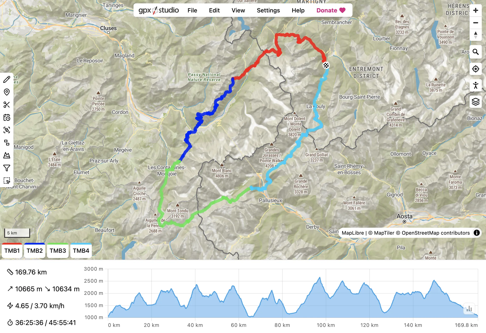

<picture>
  <source media="(prefers-color-scheme: dark)" srcset="website/static/logo-dark.svg">
  
</picture>

[**gpx.studio**](https://gpx.studio) is an online tool for creating and editing GPX files.



This repository contains the source code of the website.

## Contributing

Please create an issue if you find a bug or have a feature request.

Code contributions are also welcome, but except for obvious bug fixes, please open an issue first to discuss the changes you would like to make.

## Translation

The website is translated by volunteers on a collaborative translation platform.
You can help complete and improve the translations by joining the [Crowdin project](https://crowdin.com/project/gpxstudio).
If you would like to start the translation in a new language, please contact me or create an issue.

Any help is greatly appreciated!

## Development

The code is split into two parts:

- `gpx`: a Typescript library for parsing and manipulating GPX files,
- `website`: the website itself, which is a [SvelteKit](https://kit.svelte.dev/) application.

You will need [Node.js](https://nodejs.org/) to build and run these two parts.

### Building the `gpx` library

```bash
cd gpx
npm install
npm run build
```

### Running the website

To be able to load the map, you will need to create your own <a href="https://cloud.maptiler.com/auth/widget?next=https://cloud.maptiler.com/maps/" target="_blank">MapTiler key</a> and store it in a `.env` file in the `website` directory.

```bash
cd website
echo PUBLIC_MAPTILER_KEY={YOUR_MAPTILER_KEY} >> .env
npm install
npm run dev
```

### Running the website with Docker

Alternatively, the development server can run in a container, which pins Node to the same version used for deployment and avoids installing anything locally. You still need the `.env` file described above, and you still edit the files on your machine as usual.

```bash
docker compose up
```

The site is served on [http://localhost:5173](http://localhost:5173). Set `DEV_PORT` if that port is already taken. Dependencies are installed into Docker volumes on the first run, which takes a few minutes; later runs start in seconds, and the container reinstalls automatically whenever a lockfile changes.

Note that file changes are picked up by polling, because file system events do not cross the container boundary reliably on macOS. If hot reloading works for you with `CHOKIDAR_USEPOLLING=0`, you can turn polling off and save some CPU.

## Credits

This project has been made possible thanks to the following open source projects:

- Development:
    - [Svelte](https://github.com/sveltejs/svelte) and [SvelteKit](https://github.com/sveltejs/kit) — seamless development experience
    - [MDsveX](https://github.com/pngwn/MDsveX) — allowing a Markdown-based documentation
- Design:
    - [shadcn-svelte](https://github.com/huntabyte/shadcn-svelte) — beautiful components
    - [@lucide/svelte](https://github.com/lucide-icons/lucide/tree/main/packages/svelte) — beautiful icons
    - [tailwindcss](https://github.com/tailwindlabs/tailwindcss) — easy styling
    - [Chart.js](https://github.com/chartjs/Chart.js) — beautiful and fast charts
- Logic:
    - [immer](https://github.com/immerjs/immer) — complex state management
    - [Dexie.js](https://github.com/dexie/Dexie.js) — IndexedDB wrapper
    - [fast-xml-parser](https://github.com/NaturalIntelligence/fast-xml-parser) — fast GPX file parsing
    - [SortableJS](https://github.com/SortableJS/Sortable) — creating a sortable file tree
- Mapping:
    - [MapLibre GL JS](https://github.com/maplibre/maplibre-gl-js) — beautiful and fast interactive map rendering
    - [GraphHopper](https://github.com/graphhopper/graphhopper) — powerful routing engine
    - [OpenStreetMap](https://www.openstreetmap.org) — open map data used by most of the map layers, and by the routing engine
    - [Mapterhorn](https://github.com/mapterhorn/mapterhorn) — high-quality open terrain data used by some map layers (including for 3D), and by the routing engine
- Search:
    - [DocSearch](https://github.com/algolia/docsearch) — search engine for the documentation

## License

This project is licensed under the MIT License - see the [LICENSE](LICENSE) file for details.
